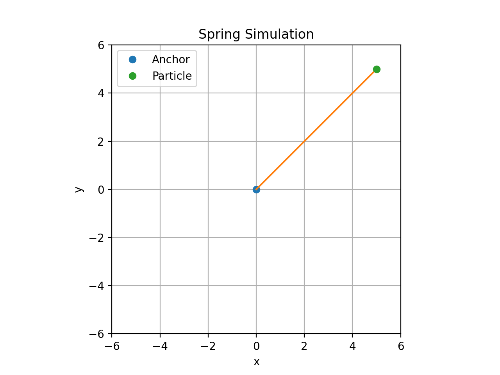
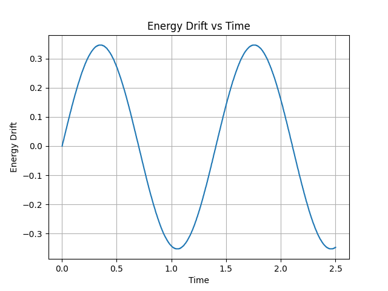

# Spring Simulation

C++ simulation of a damped harmonic oscillator using semi-implicit Euler integration.

The simulation outputs particle position, velocity, and energy data to CSV files, which can then be analyzed and visualized using Python.

## Simulation Animation

## Energy Drift

This project implements a simple **mass–spring–damper simulation** in C++.  
The system is integrated using a **semi-implicit (symplectic) Euler method** and exports simulation data to CSV for analysis and visualization.

## Features

- 2D particle simulation
- Spring restoring force
- Linear damping
- Semi-implicit Euler integration
- Energy diagnostics (kinetic, potential, total)
- CSV data export
- Python plotting pipeline

## Physics Model

The system follows the equation:

m x'' + c x' + k x = 0

Where:

- `m` = mass
- `k` = spring stiffness
- `c` = damping coefficient

Total energy is computed as:

E = K + P

where

K = ½ m v²  
P = ½ k x²

## Project Structure

spring_sim/
│
├── src/        # C++ implementation
├── include/    # headers
├── analysis/   # plotting scripts
├── data/       # simulation outputs
│
├── README.md
└── .gitignore

## Running the Simulation

Compile:
g++ src/*.cpp -o spring_sim

Run:
./spring_sim

This produces:
data/simulation_output.csv

## Plotting Results

Run the Python script:
python3 analysis/plot_simulation.py

This generates plots of:

- Position vs Time
- Velocity vs Time
- Energy vs Time
- Energy Drift

## Future Improvements

Possible extensions:

- Verlet or RK4 integrators
- multi-particle spring systems
- real-time visualization
- phase-space plots
- timestep stability analysis

## License

MIT License
